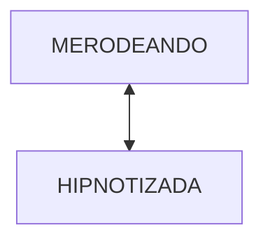
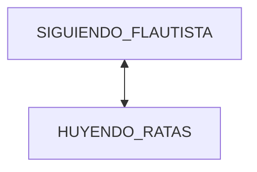
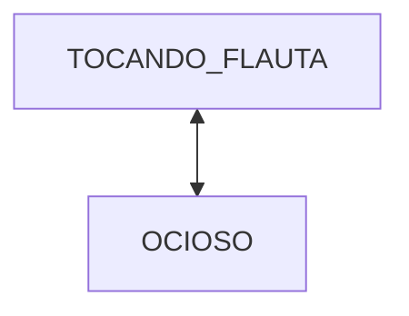
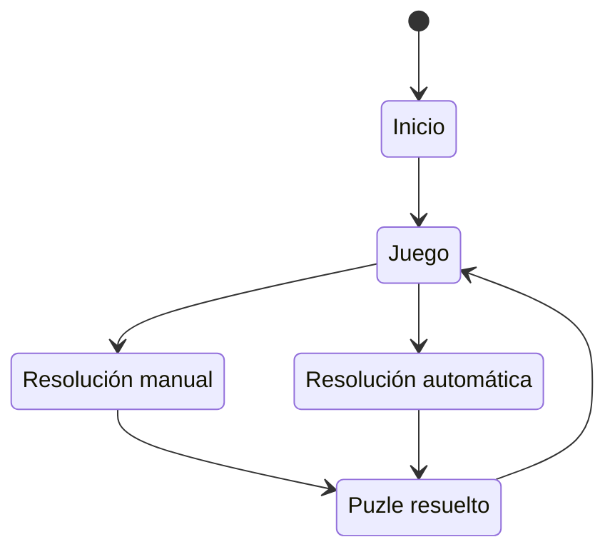
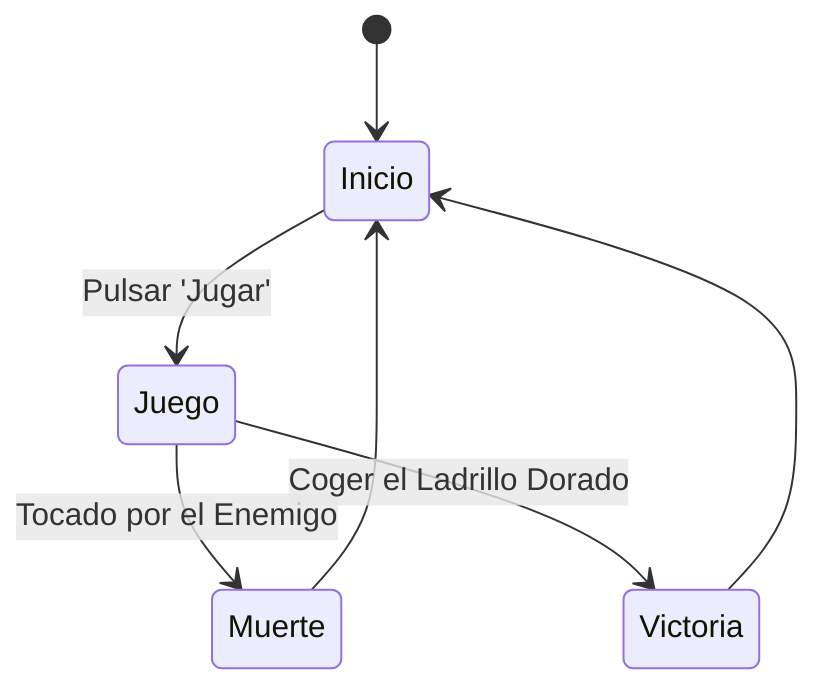

# Inteligencia Artificial para Videojuegos - Práctica 1: Plaga de Ratas

> [!NOTE]
> Versión: 1

## Autores
- Nieves Alonso Gilsanz [@nievesag](https://github.com/nievesag)
- Cynthia Tristán Álvarez [@cyntrist](https://github.com/cyntrist)

## Resumen
El proyecto consiste en prototipo de videojuego actualizado a la versión LTS de Unity que sirve de demostración técnica de algoritmos básicos de inteligencia artificial en NPCs. 

Consiste en un entorno virtual 3D que representa el pueblo de Hamelín, un personaje controlable por el jugador que es el flautista de Hamelín, un perro compañero y un montón de ratas preparadas para controlarse con IA.

## Instalación y uso
Todo el contenido del proyecto está disponible en este repositorio, con **Unity 6000.0.66f2** o posterior siendo capaces de bajar todos los paquetes necesarios.

Al no estar publicada todavía ninguna versión ejecutable del prototipo, ni enlazado ningún video con las pruebas realizadas, es necesario abrir el proyecto en Unity y usarlo desde allí.

Próximamente se publicará un release con la etiqueta `release-x`, siendo x la versión del proyecto.

## Introducción  
Este proyecto es una práctica de la asignatura de Inteligencia Artificial para Videojuegos del Grado en Desarrollo de Videojuegos de la UCM, cuyo enunciado original es este: [Plaga de Ratas](https://narratech.com/es/inteligencia-artificial-para-videojuegos/percepcion-y-movimiento/plaga-de-ratas/).

Se parte de la leyenda alemana del siglo XIII para plantear un escenario donde el jugador controla al flautista de Hamelin y todas las demás criaturas son controladas mediante IA: una de ellas es un **perro**, fiel compañero que seguirá al avatar del jugador a todas partes, aunque también hay **ratas** que merodean por todo el pueblo. El **flautista** puede tocar la flauta, y mientras lo hace, las ratas que le oigan comenzarán a seguirle. Estas pueden molestar al perro hasta el punto de hacerlo ladrar y huir, si tiene demasiadas ratas cerca.

Esta práctica consiste en desarrollar el prototipo de un entorno virtual con obstáculos y un avatar controlado por el jugador, donde representamos el movimiento de un perro y una manada de ratas. El perro persigue al flautista con control de llegada. Cada rata, si el flautista no toca su flauta, merodea por el escenario, y si la toca y esta lo escucha, se dirige hacia él, en formación con las demás ratas y controlando la llegada, hasta quedar como "hipnotizadas” a su alrededor.

Lo que se pretende con esta práctica es implementar **algoritmos de movimiento estándar** comúnmente utilizados en la industria del entretenimiento para dar vida a toda clase de seres que se mueven tanto en solitario como “en bandada”.

La versión original del prototipo proviene del repositorio de libro *Artificial Intelligence: A Modern Approach*, aunque el prototipo fue revisado y completado por Federico Peinado. El código se distribuye bajo la licencia LGPL. La versión actual y finalización del código a través del enunciado propuesto ha sido realizada por las autoras Nieves Alonso Gilsanz y Cynthia Tristán Álvarez.

## Punto de partida
Hemos partido de un proyecto base proporcionado por el profesor y disponible en este repositorio: [Hamelin - Base](https://github.com/narratech/hamelin-base)

Consiste en el entorno del pueblo ya preparado para desarrollar la IA, con cada prefab de los tres tipos de agentes ya instanciados y componentes de agentes y de animaciones configurados pero sin el código de cada tipo de movimiento implementado. Cuenta con una interfaz básica meramente informativa: 
- FPS
- Controles:
    - Crear o destruir ratas (O / P).
    - Activar o desactivar obstáculos (T).
    - Cambiar cámara (N).
    - Cambiar ratio de FPS entre 30 y 60 (F).
    - Reiniciar juego (R).
También cuenta con movimiento del avatar del jugador con WASD y dos modos de cámara que siguen al jugador, aérea y en tercera persona.

## Planteamiento del problema
<!-- 
Tenemos el clásico puzle de bloques deslizantes, de NxM dimensiones, que podemos reordenar manualmente e incluso desorganizar de manera aleatoria. Queremos probar y comparar dos resolutores automáticos para este problema de búsqueda no informada, uno basado en el algoritmo Primero en anchura y otro en Primero en profundidad.  

Desarrolla un prototipo de IA que permita resolver, tanto manual como automáticamente, el puzle deslizante de dimensiones N x N, es decir con (N x N) -1 piezas distribuidas, donde N > 1. El tablero con números de un 8-puzle será fácilmente manipulable y la solución automática se alcanzará mediante pura “fuerza bruta”. 

El prototipo permitirá:
* A. Se trabajará sobre el punto de partida para mostrar el puzle en su configuración inicial, indicando de alguna forma que el puzle se encuentra ordenado. El usuario podrá mover las piezas manualmente, tantas veces como desee. Una pieza se puede mover si es vecina del espacio libre (o “hueco”).
* B. Habrá un botón para reiniciar el puzle a su configuración inicial, y otro para desordenarlo aleatoriamente.
* C. Habrá también botones suficientes para resolver automáticamente el puzle con al menos dos estrategias no informadas.
* D. Se podrá ver la resolución paso a paso, no sólo la configuración final.
* E. Tras la resolución automática, se mostrarán medidas del éxito conseguido, como el número de pasos de la solución o el tiempo empleado en ella.

En cuanto a interfaz, arriba se mostrarán mensajes sobre la ordenación del puzle y métricas de resolución (pasos, nodos empleados, etc.) una vez que se utilizan los resolutores, y siempre se buscará una buena usabilidad con ratón, clicando sobre botones y directamente sobre las piezas en una ventana cuadrada de 640x480 píxeles o superior. 
-->

## Estados de los agentes

- Ratas:


- Perro:


- Flautista:


## Diseño de la solución
<!-- 
Para empezar se puede detallar algo sobre cómo es el escenario de juego, e incluso indicar los controles en un panel de la ventana, incluyendo cualquier atajo de teclado, etc. El botón Reset reinicia el tablero a la posición original, ajustando también filas y columnas según lo indicado en los recuadros. El botón Random actúa como Reset si hemos cambiado el tamaño de filas y columnas, y además reordena el puzle probando movimientos pseudoaleatorios. Los botones Solve BFS y Solve DFS llaman a los resolutores automáticos. Exit es para salir.

A continuación se puede añadir la representación utilizada para los datos y las estructuras intermedias (grafo de nodos) así como el pseudocódigo más preciso posible que se ha seguido para implementar el BFS y el DFS. Aquí todavía NO debemos entrar en detalles de la implementación, como el código C# del prototipo.

Indicar también cuál es la manera recomendada de realizar las pruebas, si manualmente, escribiendo texto en línea de comandos (o por el contrario, visual e interactivamente) o aprovechando algún banco de pruebas (cargando ficheros de texto, JSON o XML).


Lo que vamos a tener que utilizar:
* **Algoritmos**: Primero en anchura y Primero en profundidad (INSERTAR AQUÍ EL PSEUDOCÓDIGO)
* **Heurísticas**: Desordenar a base de clicar en piezas aleatorias
* **Trucos**: -

Por ejemplo más adelante si quisiéramos mostrar el pseudocódigo del algoritmo de llegada mostraríamos esto:

```
class Arrive:
    character: Kinematic
    target: Kinematic

    maxAcceleration: float
    maxSpeed: float

    # The radius for arriving at the target.
    targetRadius: float

    # The radius for beginning to slow down.
    slowRadius: float

    # The time over which to achieve target speed.
    timeToTarget: float = 0.1

    function getSteering() -> SteeringOutput:
        result = new SteeringOutput()

        # Get the direction to the target.
        direction = target.position - character.position
        distance = direction.length()

        # Check if we are there, return no steering.
        if distance < targetRadius:
            return null

        # If we are outside the slowRadius, then move at max speed.
        if distance > slowRadius:
            targetSpeed = maxSpeed
        # Otherwise calculate a scaled speed.
        else:
            targetSpeed = maxSpeed * distance / slowRadius

        # The target velocity combines speed and direction.
         targetVelocity = direction
        targetVelocity.normalize()
        targetVelocity *= targetSpeed

        # Acceleration tries to get to the target velocity.
        result.linear = targetVelocity - character.velocity
        result.linear /= timeToTarget

        # Check if the acceleration is too fast.
        if result.linear.length() > maxAcceleration:
            result.linear.normalize()
            result.linear *= maxAcceleration

        result.angular = 0
        return result
```

También es posible mostrar diagramas...


Aunque mejor que insertar imágenes, conviene usar Mermaid:


Para dibujar espacios de coordenadas 2D con puntos y vectores, se podría incrustar una imagen de Google Draw, o intentar incrustarlo en el repositorio también con Mermaid. 
-->

## Implementación
<!-- 
Las tareas se han realizado y el esfuerzo ha sido repartido entre los autoresha (en mi caso ha sido asumido por el único autor, claro).

Esto se podrá documentar en una tabla como esta o usando la [pestaña de Proyectos](https://github.com/orgs/narratech/projects/4/views/1) de GitHub.

| Estado  |  Tarea  |  Fecha  |  
|:-:|:--|:-:|
| ✔ | Diseño: Primer borrador | 1-2-2020 |
| ✔ | Desarrollo: Implementación del juego | 10-2-2020 |
| ✔ | Desarrollo: Implementación del resolutor | 13-2-2020 |
| ✔ | Desarrollo: Migración a Unity 2019 | 25-2-2021 |
| ✔ | Desarrollo: Migración a Unity 2022 | 24-2-2024 |
|   | ... | |
| :x: | Corregir error en resolutores | ... |
|  | AMPLIACIONES |  |
| ✔ | Generador pseudoaleatorio | 3-12-2022 |
| :x: | Menú | 3-12-2022 |
| :x: | HUD | 12-12-2022 |

Las clases principales que se han desarrollados son las siguientes.

```mermaid
classDiagram
      BlockBoard <|-- MonoBehaviour
      CameraManager <|-- MonoBehaviour
      MovableBlock <|-- MonoBehaviour
      SlidingPuzzleManager <|-- MonoBehaviour
      class IDeepCloneable
      <<interface>> IDeepCloneable

      class IDeepCloneableT ["IDeepCloneable < T >"]
      <<interface>> IDeepCloneableT

      class Position

      SlidingPuzzle <|-- IDeepCloneableSP : implements
      class IDeepCloneableSP ["IDeepCloneable < SlidingPuzzle >"]
      <<interface>> IDeepCloneableSP
      SlidingPuzzle <|-- IEquatableSP : implements
      class IEquatableSP  ["IEquatable < SlidingPuzzle >"]
      <<interface>> IEquatableSP 
      SlidingPuzzle <|-- IComparableSP : implements
      class IComparableSP ["IComparable < SlidingPuzzle >"]
      <<interface>> IComparableSP
      SlidingPuzzle <|-- IComparable  : implements
      class IComparable
      <<interface>> IComparable

      class SlidingPuzzleFunctionFactory
      SlidingPuzzleGoalTest <|-- GoalTest : implements
      <<interface>> GoalTest
      class SlidingPuzzleSolver

      BasicOperator <|-- Operator : implements
      <<interface>> Operator
      NoOperator <|-- Operator : implements
      <<interface>> Operator

      FIFOQueueT <|--  QueueT
      class FIFOQueueT ["FIFOQueue < T >"]
      class QueueT ["Queue < T >"]

      FIFOQueueT <|--  IQueueT  
      class IQueueT ["IQueue < T >"]
      <<interface>> IQueueT
      IQueueT <|-- IEnumerableT 
      class IEnumerableT ["IEnumerable < T >"]
      <<interface>> IEnumerableT
      LIFOQueueT <|--  StackT
      class LIFOQueueT ["LIFOQueue < T >"] 
      class StackT ["Stack < T >"]
      LIFOQueueT <|-- IQueueT : implements

      class ApplicableOperatorsFunction
      <<interface>> ApplicableOperatorsFunction
      DefaultStepCostFunction <|-- StepCostFunction
      class GoalTest
      <<interface>> GoalTest
      GraphSearch <|-- QueueSearch
      class Metrics

      Node <|-- IEquatableN
      class IEquatableN ["IEquatable < Node >"]
      <<interface>> IEquatableN
      Node <|-- IComparableN
      class IComparableN ["IComparableN < Node >"]
      <<interface>> IComparableN
      Node <|-- IComparable
      class IComparable
      <<interface>> IComparable

      class NodeExpander
      class Problem
      QueueSearch <|--  NodeExpander
      class Search
      <<interface>> Search
      class SearchUtils
      class StepCostFunction
      <<interface>> StepCostFunction
      class TransitionModel
      <<interface>> TransitionModel

      BreadthFirstSearch <|--  Search : implements
      DepthFirstSearch <|--  Search : implements
```

-->

<!-- 
## Ampliaciones
Si se han realizado ampliaciones explicarlo: se han realizado las siguientes ampliaciones

- Los obstáculos del escenario se colocan...
-->

## Pruebas y métricas
<!-- 
Detallar la serie más corta y rápida posible de pruebas que pueden realizarse para verificar que se cumple todo lo que piden el enunciado:
-->
Serie corta y rápida posible de pruebas que pueden realizarse para verificar que se cumplen las características requeridas:

1. Arranca la aplicación y haz un par de Reset para mostrar el puzle en su configuración inicial, y ver que se indica cuando el puzle está ordenado.  
2. Clica tres veces en piezas vecinas del espacio libre o “hueco” (y en algunas que no lo sean) para ver que se pueden mover las piezas manualmente.  
3. Usa el botón Reset para reiniciar el puzle a su configuración inicial y luego Random para ver que efectivamente se desordena aleatoriamente.  
4. Usa el botón Solve BFS primero, y Solve DFS después (sobre un puzle de tamaño pequeño y no demasiado desordenando) para ver que se puede resolver automáticamente el puzle con esas dos estrategias no informadas.
5. Observa la resolución paso a paso, no sólo su configuración final.  
6. Observa las medidas del éxito (pasos, tiempo...) al terminar.

- [Vídeo demostración](https://www.youtube.com/watch?v=wdlJquAlGWI)

<!--
## Conclusiones
Queda toda la posproducción por hacer: el pulido y la distribución del ejecutable del juego, así como la publicación del video-documental con las pruebas.

Para ir más allá en el aprendizaje, para el futuro consideramos estas posibles ampliaciones:
* Aumentar el número de estrategias (algoritmos) utilizados, para compararlos.
* Ofrecer más medidas del éxito, como número de nodos expandidos, nivel de profundidad alcanzado, memoria máxima utilizada durante la resolución, etc.
* Probar con alguna estrategia informada, pensando en alguna heurística válida.
* Usar otros algoritmos, otros tipos de búsqueda (informada) o un resolutor interactivo. 
* Generalizar el problema a puzles NxM.
* Generalizar el problema a puzles con piezas que ocupan más de una casilla.
-->

## Licencia
Nieves Alonso Gilsanz y Cynthia Tristán Álvarez, con el permiso de Federico Peinado, autores de la documentación, código y recursos de este trabajo, concedemos permiso permanente para utilizar este m aterial, con sus comentarios y evaluaciones, con fines educativos o de investigación; ya sea para obtener datos agregados de forma anónima como para utilizarlo total o parcialmente reconociendo expresamente nuestra autoría. 


## Referencias
A continuación se detallan todas las referencias bibliográficas, lúdicas o de otro tipo utilizdas para realizar este prototipo. Los recursos de terceros que se han utilizados son de uso público.

Lousberg, K. (s. f.). [*Kaykit animations*](https://kaylousberg.itch.io/kaykit-animations)

Lousberg, K. (s. f.). [*Kaykit dungeon*](https://kaylousberg.itch.io/kaykit-dungeon)

Lousberg, K. (s. f.). [*Kaykit medieval builder pack*](https://kaylousberg.itch.io/kaykit-medieval-builder-pack)

Millington, I. (2019). *AI for games* (3rd ed.). CRC Press.


