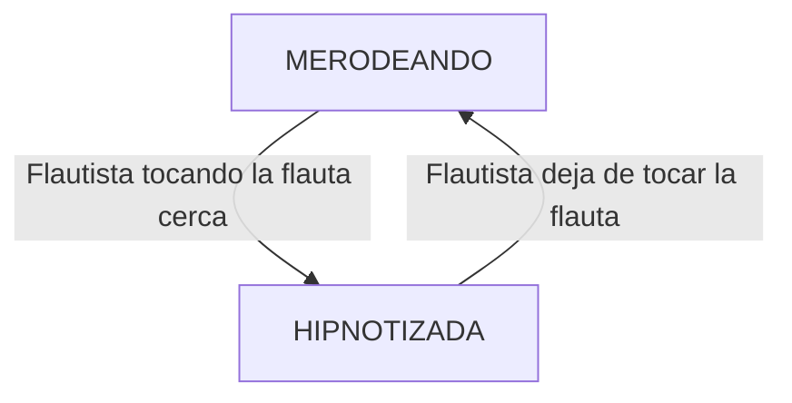
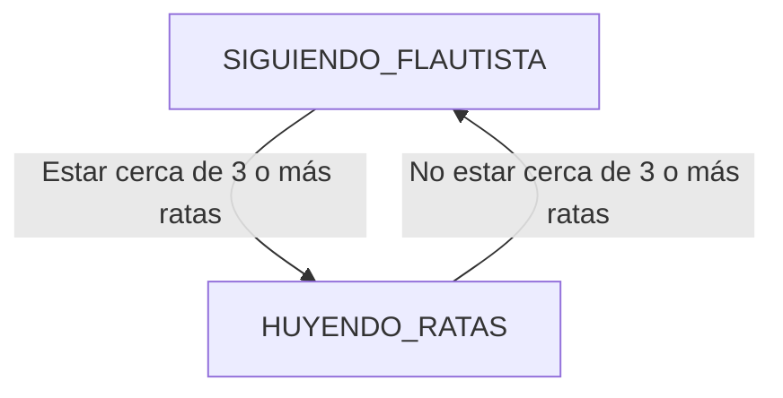
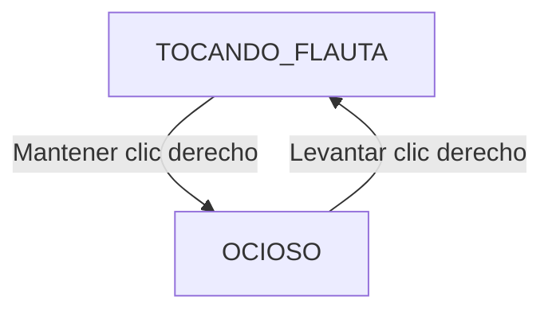
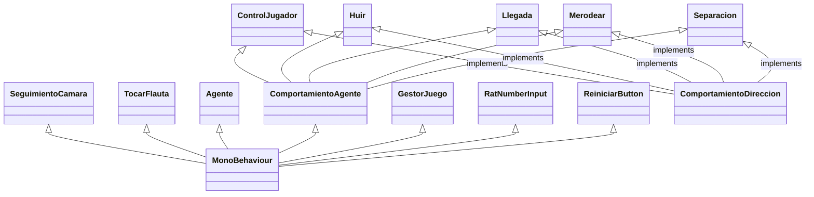

# Inteligencia Artificial para Videojuegos - Práctica 1: Plaga de Ratas

> [!NOTE]
> Versión: 1

## Índice
1. [Autores](#autores)
1. [Resumen](#resumen)
1. [Instalación y uso](#instalación-y-uso)
1. [Introducción](#introducción)
1. [Punto de partida](#punto-de-partida)
1. [Planteamiento del problema](#planteamiento-del-problema)
1. [Diseño de la solución](#diseño-de-la-solución)
1. [Implementación](#implementación)
1. [Pruebas y métricas](#pruebas-y-métricas)
1. [Conclusiones](#conclusiones)
1. [Licencia](#licencia)
1. [Referencias](#referencias)


## Autores
- Nieves Alonso Gilsanz [@nievesag](https://github.com/nievesag)
- Cynthia Tristán Álvarez [@cyntrist](https://github.com/cyntrist)

## Resumen
El proyecto consiste en un prototipo de videojuego que sirve de demostración técnica de algoritmos estándar de inteligencia artificial en NPCs en un entorno virtual 3D que representa el pueblo de Hamelín, un personaje controlable por el jugador que es el flautista de Hamelín y un perro compañero y un montón de ratas controlados con IA.

## Instalación y uso
Todo el contenido del proyecto está disponible en este repositorio, con **Unity 6000.0.66f2** o posterior siendo capaces de bajar todos los paquetes necesarios.

Al no estar publicada todavía ninguna versión ejecutable del prototipo, ni enlazado ningún video con las pruebas realizadas, es necesario abrir el proyecto en Unity y usarlo desde allí.

Próximamente se publicará un release con la etiqueta `release-x`, siendo *x* la versión del proyecto.

## Introducción  
Este proyecto es una práctica de la asignatura de Inteligencia Artificial para Videojuegos del Grado en Desarrollo de Videojuegos de la UCM, cuyo enunciado original es este: [Plaga de Ratas](https://narratech.com/es/inteligencia-artificial-para-videojuegos/percepcion-y-movimiento/plaga-de-ratas/).

Se parte de la leyenda alemana del siglo XIII para plantear un escenario donde el jugador controla al flautista de Hamelin y todas las demás criaturas son controladas mediante IA: una de ellas es un **perro**, fiel compañero que seguirá al avatar del jugador a todas partes, aunque también hay **ratas** que merodean por todo el pueblo. El **flautista** puede tocar la flauta, y mientras lo hace, las ratas que le oigan comenzarán a seguirle. Estas pueden molestar al perro hasta el punto de hacerlo ladrar y huir, si tiene demasiadas ratas cerca.

Lo que se pretende con esta práctica es implementar **algoritmos de movimiento estándar** comúnmente utilizados en la industria del entretenimiento para dar vida a toda clase de seres que se mueven tanto en solitario como “en bandada”.

La versión original del prototipo proviene del repositorio de libro *Artificial Intelligence: A Modern Approach*, aunque el prototipo fue revisado y completado por Federico Peinado. El código se distribuye bajo la licencia LGPL. La versión actual y finalización del código a través del enunciado propuesto ha sido realizada por las autoras Nieves Alonso Gilsanz y Cynthia Tristán Álvarez.

## Punto de partida
Hemos partido de un proyecto base proporcionado por el profesor y disponible en este repositorio: [Hamelin - Base](https://github.com/narratech/hamelin-base)

La base consiste en el entorno del pueblo ya preparado para desarrollar la IA, con cada prefab de los tres tipos de agentes ya instanciados y componentes de agentes y de animaciones configurados pero sin el código de cada tipo de movimiento implementado. Cuenta con una interfaz básica meramente informativa con: 
- FPS
- Contador de ratas
- Controles:
    - Crear o destruir ratas (O / P).
    - Activar o desactivar obstáculos (T).
    - Cambiar cámara (N).
    - Cambiar ratio de FPS entre 30 y 60 (F).
    - Reiniciar juego (R).
También cuenta con movimiento del avatar del jugador con WASD y dos modos de cámara que siguen al jugador, aérea y en tercera persona.

## Planteamiento del problema
Esta práctica consiste en desarrollar el prototipo de un entorno virtual con obstáculos y un avatar controlado por el jugador, donde representamos el movimiento de un perro y una manada de ratas. El perro persigue al flautista con control de llegada. Cada rata, si el flautista no toca su flauta, merodea por el escenario, y si la toca y esta lo escucha, se dirige hacia él, en formación con las demás ratas y controlando la llegada, hasta quedar como "hipnotizadas” a su alrededor.

**El prototipo permitirá:**
* **A.** El punto de partida será el **mundo virtual con obstáculos Hamelín**, allí se ubican tanto el avatar del jugador como el agente que lo acompaña y la bandada de agentes que lo suele seguir. También permite cambiar entre tres cámaras: una general que está fija, otra que sigue al avatar en tercera persona y otra que sigue al acompañante.
* **B.** El **avatar** (flautista) es controlado por el jugador mediante el *ratón*. Si el *puntero* está más allá de *cierta distancia* del avatar, este camina en línea recta hacia la posición del puntero. Mientras se mantiene pulsado el *clic izquierdo*, el avatar corre más rápido, y si es el *clic derecho*, toca la flauta.
* **C.** El **acompañante** (perro) persigue continuamente al avatar del jugador con predicción (dinámica, especialmente marcada si el avatar corre) y control de llegada hasta quedarse a una cierta distancia del avatar. El acompañante encara en dirección a su propio movimiento y cuando detecta 3 o más agentes de la bandada a menos de *cierta distancia*, deja de perseguir al avatar para pasar a ladrar como loco mientras huye de la bandada hasta no tener *ningún* agente de la bandada a menos de *cierta distancia*.
* **D.** Mientras el avatar *no está* tocando la flauta, cada **agente individual de la bandada** (rata) merodea por todo el mundo virtual con obstáculos (con un movimiento errático y desordenado).
* **E.** Mientras el avatar *está* tocando la flauta, los agentes de la bandada (manada de ratas) encaran rápidamente al avatar y se produce su desplazamiento en bandada (hipnosis), con movimiento dinámico en formación (combinando *seguimiento*, fuerte *cohesión* y débil *separación*) y control de llegada hasta quedarse a *cierta distancia* del avatar. El prototipo está implementado de manera eficiente para *maximizar todo lo posible las métricas*, que en este caso son *el número* de agentes de la bandada que se pueden ubicar en el mundo virtual con obstáculos y seguir al avatar mientras se mantiene un ratio estable de 30 ó 60 fotogramas por segundo.

En cuanto a interfaz, hay un botón para reiniciar la simulación; Un campo de texto que permite introducir un número N y, pulsando un botón, ajustar el número exacto de agentes que hay en la bandada, creando o destruyendo todos los que hagan falta hasta alcanzar esa cifra.

## Diseño de la solución
El escenario del juego cuenta con un plano y unos obstáculos que representan el pueblo de Hamelin, sobre el que se moverán los agentes: el flautista (avatar del jugador), el perro (acompañante) y las ratas (agentes erráticos/bandada seguidora). 

En la interfaz destacan los controles previamente descritos en [Punto de Partida](#punto-de-partida), además de un **campo de entrada** con un **botón '*Ratear*'** con el que instanciar y destruir ratas en la parte inferior izquierda de la pantalla y un **botón '*Reiniciar*'** que reiniciará el juego situado en la esquina inferior derecha. 

El jugador se controla:
- Moviendo el ratón hacia la posición deseada y manteniendo el **clic izquierdo** para que vaya más rápido. 
- Manteniendo el **clic derecho** hará que toque la flauta.

A continuación se detallan los estados de cada agente así como el pseudocódigo que se ha seguido para implementar a cada uno. 

La manera recomendada de realizar las pruebas está descrita en [Pruebas y Métricas](#pruebas-y-métricas)

### Estados de los agentes

- **Ratas**:


- **Perro**:


- **Flautista**:


Lo distintos algoritmos usados han sido para cada agente de IA:
* **Perro**: 
    * Persecución y evasión, que hereda de:
        * Seguimiento
    * Llegada dentro
    * Huida
* **Ratas**: 
    * Merodeo, que hereda de:
        * Encaramiento, que hereda de:
            * Alineamiento
    * Seguimiento con llegada dentro
    * Separación

### Persecución y evasión 
```
class Pursue extends Seek:
    # The maximum prediction time.
    maxPrediction: float

    # OVERRIDES the target data in seek (in other words this class has
    # two bits of data called target: Seek.target is the superclass
    # target which will be automatically calculated and shouldn't be set,
    # and Pursue.target is the target we're pursuing).
    target: Kinematic

    # ... Other data is derived from the superclass...

    function getSteering()-> SteeringOutput:
        # 1. Calculate the target to delegate to seek
        # Work out the distance to target.
        direction = target.position - character.position
        distance = direction.length()

        # Work out our current speed.
        speed = character.velocity.length()

        # Check if speed gives a reasonable prediction time.
        if speed <= distance / maxPrediction:
            prediction maxPrediction
        # Otherwise calculate the prediction time.
        else:
            prediction = distance / speed

        # Put the target together.
        Seek.target = explicitTarget
        Seek.target.position += target.velocity * prediction

        # 2. Delegate to seek.
        return Seek.getSteering()
```

### Seguimiento y huida con llegada dentro 
```
class Arrive:
    character: Kinematic
    target: Kinematic

    maxAcceleration: float
    maxSpeed: float

    # The radius for arriving at the target.
    targetRadius: float

    # The radius for beginning to slow down.
    slowRadius: float

    # The time over which to achieve target speed.
    timeToTarget: float = 0.1

    function getSteering() -> SteeringOutput:
        result = new SteeringOutput()

        # Get the direction to the target.
        direction = target.position - character.position
        distance = direction.length()

        # Check if we are there, return no steering.
        if distance < targetRadius:
            return null

        # If we are outside the slowRadius, then move at max speed.
        if distance > slowRadius:
            targetSpeed = maxSpeed
        # Otherwise calculate a scaled speed.
        else:
            targetSpeed = maxSpeed * distance / slowRadius

        # The target velocity combines speed and direction.
         targetVelocity = direction
        targetVelocity.normalize()
        targetVelocity *= targetSpeed

        # Acceleration tries to get to the target velocity.
        result.linear = targetVelocity - character.velocity
        result.linear /= timeToTarget

        # Check if the acceleration is too fast.
        if result.linear.length() > maxAcceleration:
            result.linear.normalize()
            result.linear *= maxAcceleration

        result.angular = 0
        return result
```

### Alineamiento
```
class Align:
    character: Kinematic
    target: Kinematic

    maxAngularAcceleration: float
    maxSpeed: float

    # The radius for arriving at the target.
    targetRadius: float

    # The radius for beginning to slow down.
    slowRadius: float

    # The time over which to achieve target speed.
    timeToTarget: float = 0.1
    
    function getSteering() -> SteeringOutput:
        result = new SteeringOutput()
        
        # Get the naive direction to the target.
        rotation = target.orientation - character.orientation

        # Map result to the (-pi, pi) interval.
        rotation = mapToRange(rotation)
        rotationSize = abs(rotation)

        # Check if que are there, return no steering.
        if rotationSize < targetRadius:
            return null

        # If we are outside the slowRadius, then use maximum rotation.
        if rotationSize > slowRadius:
            targetRotation = maxRotation
        # Otherwise calculate a scaled rotation.
        else:
            targetRotation = maxRotation * rotationSize / slowRadius
        
        # The final target rotation combines speed (already in the variable) and direction.
        targetRotation *= rotation / rotationSize

        # Acceleration tries to get to the target rotation.
        result.angular = targetRotation - character.rotation
        result.angular /= timeToTarget

        # Check if the acceleration is too great.
        angularAcceleration = abs(result.angular)
        if angularAcceleration > maxAngularAcceleration:
            result.angular /= angularAcceleration
            result.angular *= maxAngularAcceleration

        result.linear = 0
        return result
```

### Encaramiento
```
class Face extends Align:
    # ... Other data is derived from the superclass ...
    function getSteering() -> SteeringOutput:
        # 1. Calculate the target to delegate to align
        # Work out the direction to target.
        direction = target.position - character.position

        # Check for a zero direction, and make no change if so.
        if direction.length() == 0:
            return target

        # 2. Delegate to align.
        Align.target = explicitTarget
        Align.target.orientation = atan2(-direction.x, direction.z)
        return Align.getSteering()
        
```

### Merodeo
```
class Wander extends Face:
    # The radius and forward offset of the wander circle.
    wanderOffser: float
    wanderRadius: float

    # The maximum rate at which the wander orientation can change.
    wanderRate: float

    # The current orientation of the wander target.
    wanderOrientation: float

    # The maximum acceleration of the character.
    maxAcceleration: float

    # Again we don't need a new target.
    # ... Other data is derived from the superclass ...
    function getSteering() -> SteeringOutput:
        # 1. Calculate the target to delegate to face
        # Update the wander orientation.
        wanderOrientation += randomBinomial() * wanderRate

        # Calculate the combined target orientation.
        targetOrientation = wanderOrientation + character.orientation

        # Calculate the center of the wander circle.
        target = character.position + wanderOffset * character.orientation.asVector()

        # Calculate the target location.
        target += wanderRadius * targetOrientation.asVector()

        # 2. Delegate to face.
        result = Face.getSteering()

        # 3. Now set the linear acceleration to be at full accleleration in the direction of the orientation.
        result.linear = maxAcceleration * character.orientation.asVector()

        # Return it.
        return result
```

### Separación
```
class Separation:
    character: Kinematic
    maxAcceleration: float

    # A list of potential targets.
    targets: Kinematic[]
    
    # The threshold to take action.
    threshold: float
    
    # The constant coefficient of decay for the inverse square law.
    decayCoefficient: float
    
    function getSteering() -> SteeringOutput:
        result = new SteeringOutput()
        
        # Loop through each target.
        for target in targets:
            # Check if the target is close.
            direction = target.position - character.position
            distance = direction.length()
            
            if distance > threshold:
                # Calculate the strength of repulsion (here using the inverse square law).
                strength = min(decayCoefficient / (distance * distance), maxAcceleration)
            
            # Add the acceleration.
            direction.normalize()
            result.linear += strength * direction
        
        return result
```


## Implementación
**Tareas:**
Las tareas y el esfuerzo ha sido repartido de manera equitativa entre las autoras.

| Estado  |  Tarea  |  Fecha  |  
|:-:|:--|:-:|
| ✔ | Cámara fija | 29-1-2026 |
| ✔ | Cámara avatar (flautista) | 29-1-2026 |
| ✔ | Cámara acompañante (perro) | 29-1-2026 |
| ✔ | Campo de texto en interfaz y control de spawn/despawn de ratas básico | 3-2-2026 |
| ✔ | Control de spawn/despawn por corrutina | 5-2-2026 |
| ✔ | Botón de reinicio en interfaz | 8-2-2026 |
| ✔ | Seguimiento del agente acompañante (perro) | 8-2-2026 |
| ✔ | Merodeo de los agentes de la bandada (ratas) | 10-2-2026 |
| ✖ | Movimiento del avatar con input de ratón | ... |
| ✖ | Huida del agente acompañante (perro) | ... |
| ✖ | Hipnosis de los agentes de la bandada (ratas) | ... |
|  | AMPLIACIONES |  |
|  | ... |  |

<br>

**Diagrama de clases:**
Las clases principales que se han desarrollados son las siguientes.


<br>

**Implementación:**
Se adjuntan los scripts con el código fuente que implementan las principales características.

| Característica del prototipo | Script |
|:-:|:-:|
| Huida del agente acompañante (perro) | [Huir](https://github.com/IAV26-G09/IAV26-G09-P1/blob/main/Assets/Scripts/Comportamientos/Huir.cs) |
| Movimiento del avatar con input de ratón y teclado | [ControlJugador](https://github.com/IAV26-G09/IAV26-G09-P1/blob/main/Assets/Scripts/Comportamientos/ControlJugador.cs) |
| Seguimiento del agente acompañante (perro) | [LLegada](https://github.com/IAV26-G09/IAV26-G09-P1/blob/main/Assets/Scripts/Comportamientos/Llegada.cs) |
| Merodeo de los agentes de la bandada (ratas) | [Merodear](https://github.com/IAV26-G09/IAV26-G09-P1/blob/main/Assets/Scripts/Comportamientos/Merodear.cs) |
| Hipnosis de los agentes de la bandada (ratas) | [Separacion](https://github.com/IAV26-G09/IAV26-G09-P1/blob/main/Assets/Scripts/Comportamientos/Separacion.cs) |
| Hipnosis de los agentes de la bandada (ratas) | [TocarFlauta](https://github.com/IAV26-G09/IAV26-G09-P1/blob/main/Assets/Scripts/Comportamientos/TocarFlauta.cs) |
| Gestión de comportamientos asociados a los agentes | [Agente](https://github.com/IAV26-G09/IAV26-G09-P1/blob/main/Assets/Scripts/Agente.cs) |
| Plantilla para los comportamientos de los agentes (se han implementado GetSteeringSeek, GetSteeringAlign, GetSteeringFace) | [ComportamientoAgente](https://github.com/IAV26-G09/IAV26-G09-P1/blob/main/Assets/Scripts/ComportamientoAgente.cs) |
| Clase auxiliar para representar el comportamiento de dirección | [ComportamientoDireccion](https://github.com/IAV26-G09/IAV26-G09-P1/blob/main/Assets/Scripts/ComportamientoDireccion.cs) |
| GameManager (gestiona estados, entidades y cámaras) | [GestorJuego](https://github.com/IAV26-G09/IAV26-G09-P1/blob/main/Assets/Scripts/GestorJuego.cs) |
| Control de spawn/despawn por corrutina | [RatNumberInput](https://github.com/IAV26-G09/IAV26-G09-P1/blob/main/Assets/Scripts/RatNumberInput.cs) |
| Botón de reinicio en interfaz | [ReiniciarButton](https://github.com/IAV26-G09/IAV26-G09-P1/blob/main/Assets/Scripts/ReiniciarButton.cs) |

<!-- 
## Ampliaciones
Si se han realizado ampliaciones explicarlo: se han realizado las siguientes ampliaciones

- Los obstáculos del escenario se colocan...
-->

## Pruebas y métricas
Serie corta y rápida posible de pruebas que pueden realizarse para verificar que se cumplen las características requeridas:

* **1.** Arrancar el juego y comprobar el control del avatar moviendo y clicando con el ratón a lo largo del pueblo.
* **2.** Comprobar seguimiento del perro cuando se está moviendo el avatar.
* **3.** Comprobar los distintos tipos de cámaras pulsando N: cámara fija, cámara que sigue al jugador y cámara que sigue al perro, moviendo al avatar mientras se realiza este paso.
* **4.** Instanciar una cantidad de ratas X, introduciendo un número mayor a 1 con el campo de entrada en la parte inferior izquierda de la interfaz a través del teclado y haciendo a clic en el botón contiguo "Ratear".
* **5.** Observar el patrón de movimiento errático, merodeo, de las ratas instanciadas.
* **6.** Destruir una cantidad de ratas Y, introduciendo un número menor al de ratas actuales y mayor o igual que 0 en el campo de entrada de la interfaz a través del teclado y haciendo clic en el botón contiguo "Ratear".
* **7.** Tocar la flauta con el clic derecho.
* **8.** Hipnotizar ratas tocando la flauta cerca de ellas.
* **9.** Comprobar movimiento en bandada de las ratas hipnotizadas.
* **10.** Comprobar huida del perro cuando se encuentra cerca de 3 o más ratas, y seguimiento de nuevo al avatar cuando no.
* **11.** Hacer clic en el botón "Reiniciar" de la interfaz para comenzar de nuevo la simulación con la configuración inicial.
* **12.** Repetir cualquier paso.

- [Vídeo demostración](https://www.youtube.com/watch?v=wdlJquAlGWI)

## Conclusiones
Dado que el desarrollo de la práctica se halla en su ecuador, es demasiado pronto como para sacar conclusiones del aprendizaje, pero se han planteado para ir más allá del aprendizaje en el futuro estas posibles ampliaciones:
* Que las ratas tengan un momento estático entre movimiento y movimento.
* Que las ratas tengan un ángulo mínimo con respecto a su último movimiento sobre el que girar.
* Detección de obstáculos en los algoritmos de todos los agentes.

## Licencia
Nieves Alonso Gilsanz y Cynthia Tristán Álvarez, con el permiso de Federico Peinado, autores de la documentación, código y recursos de este trabajo, concedemos permiso permanente para utilizar este material, con sus comentarios y evaluaciones, con fines educativos o de investigación; ya sea para obtener datos agregados de forma anónima como para utilizarlo total o parcialmente reconociendo expresamente nuestra autoría. 

## Referencias
A continuación se detallan todas las referencias bibliográficas, lúdicas o de otro tipo utilizdas para realizar este prototipo. Los recursos de terceros que se han utilizados son de uso público.

Lousberg, K. (s. f.). [*Kaykit animations*](https://kaylousberg.itch.io/kaykit-animations)

Lousberg, K. (s. f.). [*Kaykit dungeon*](https://kaylousberg.itch.io/kaykit-dungeon)

Lousberg, K. (s. f.). [*Kaykit medieval builder pack*](https://kaylousberg.itch.io/kaykit-medieval-builder-pack)

Millington, I. (2019). *AI for games* (3rd ed.). CRC Press.
